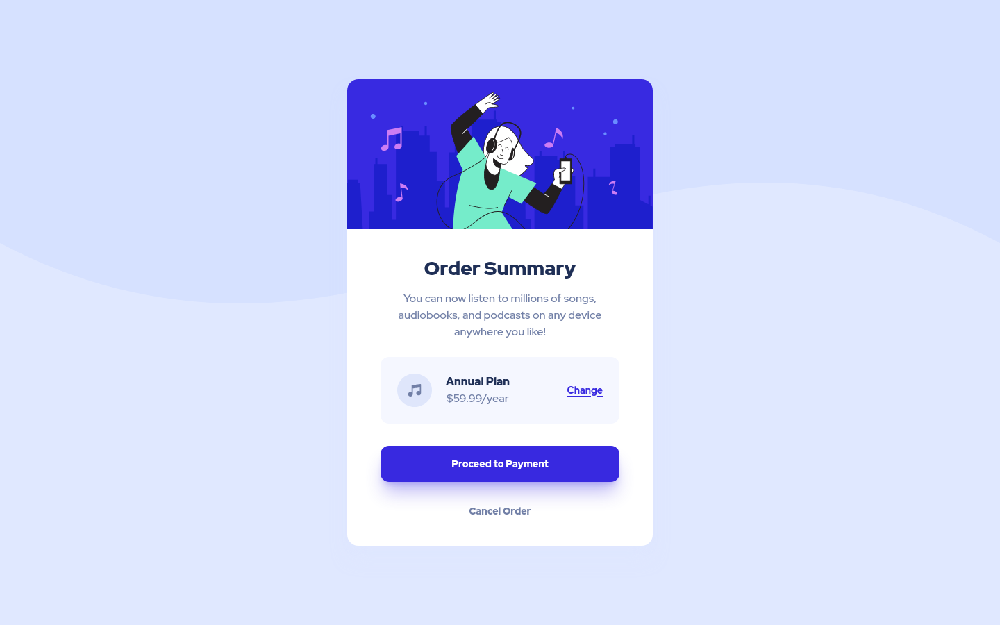

# Frontend Mentor - Order summary card solution

This is a solution to the [Order summary card challenge on Frontend Mentor](https://www.frontendmentor.io/challenges/order-summary-component-QlPmajDUj). Frontend Mentor challenges help you improve your coding skills by building realistic projects.

## Table of contents

- [Overview](#overview)
  - [The challenge](#the-challenge)
  - [Screenshots](#screenshots)
  - [Links](#links)
- [My process](#my-process)
  - [Built with](#built-with)
- [Author](#author)

## Overview

### The challenge

Users should be able to:

- See hover states for interactive elements

### Screenshots

|  |
| :-------------------------------------------------------------------------------------------------------------------------: |
|                                           Order Summary Component (Desktop View)                                            |

|  |
| :-----------------------------------------------------------------------------------------------------------------------: |
|                                           Order Summary Component (Mobile View)                                           |

### Links

- Solution URL: [https://6315b55e1b29b12688b2545b--preeminent-melomakarona-0a6b50.netlify.app/](https://6315b55e1b29b12688b2545b--preeminent-melomakarona-0a6b50.netlify.app/)

## My process

### Built with

- Semantic HTML5 markup
- Flexbox
- Mobile-first workflow
- [React](https://reactjs.org/) - JS library
- [Next.js](https://nextjs.org/) - React framework
- [TailwindCSS](https://tailwindcss.com) - CSS Utility Framework

## Author

- Frontend Mentor - [@iamhimanshusrivastava](https://www.frontendmentor.io/profile/iamhimanshusrivastava)
- Twitter - [@coderhimanshu](https://www.twitter.com/coderhimanshu)
